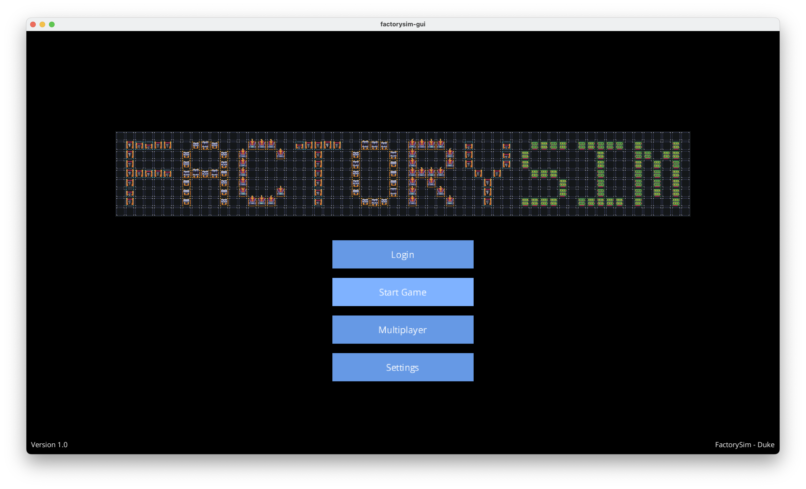

# FactorySIM

An educational, large‐scale factory simulation developed for ECE 651 (Duke University) Final Project. This multi‐module system models discrete‐time “demand‐pull” factory operations, supports both a command-line interface and a LibGDX-based graphical UI, and incorporates advanced features such as storage buildings, configurable policies, and networked server control.


---

## 📁 Repository Structure

- **`factorysim/`**  
  Core simulation logic (Evolution 1)   
  - JSON input parser (`doors1.json` example)   
  - Discrete‐time simulation engine, building/request management, CLI commands

- **`factorysim-gui/`**  
  Graphical interface built with LibGDX (Evolution 2)   
  - 2D tile‐map renderer  
  - Panels for logs, building details, request queues, policy selectors  
  - Drag-and-click controls for requests, connections, save/load

- **`factorysim-server/`**  
  Optional server component for remote save/load.

---

## 🚀 Getting Started

### Prerequisites

- **Java 21** 
- **Gradle 8.13**  
- **Git**

### Clone & Build

- Clone **factorysim-server**
- Clone **factorysim-gui**
- Clone **factorysim**

### Run

- **Command-Line Interface**  
  ```bash
  ./gradlew run --args="path/to/config.json"
  ```
  Supports all Evolution 1 commands (`request`, `step`, `finish`, `verbose`, `set policy`, `save`, `load`) 

- **Graphical Interface**  
  ```bash
  ./gradlew lwjgl3:run
  ```
  – Use mouse/keyboard to load worlds, issue requests, adjust policies, and visualize item flow   
  – To fall back to CLI mode:  
    ```bash
    ./gradlew lwjgl3:run -nw --args="-nw path/to/config.json"
    ```

- **Server**  
  ```bash
  xxxx
  ```

## 📝 Development Notes

Design sketches, task plans, and implementation notes can be found in our shared Google Doc:  
[Development Notes](https://docs.google.com/document/d/1wrDHeLhQa1QFEoR7M-aTM2SpQoXwXDGJH6GcnYm5E4o/edit?tab=t.nidgft29hm4b)
