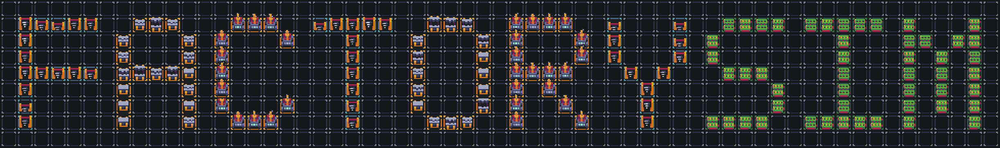

```markdown
# FactorySIM

An educational, large‐scale factory simulation developed for ECE 651 (Duke University) Final Project. This multi‐module system models discrete‐time “demand‐pull” factory operations, supports both a command-line interface and a LibGDX-based graphical UI, and incorporates advanced features such as storage buildings, configurable policies, and networked server control.



---

## 📁 Repository Structure

- **`factorysim/`**  
  Core simulation logic (Evolution 1)   
  - JSON input parser (`doors1.json` example)   
  - Discrete‐time simulation engine, building/request management, CLI commands

- **`factorysim-server/`**  
  Optional server component for remote control or integration with other services

- **`factorysim-gui/`**  
  Graphical interface built with LibGDX (Evolution 2)   
  - 2D tile‐map renderer  
  - Panels for logs, building details, request queues, policy selectors  
  - Drag-and-click controls for requests, connections, save/load

- **`gitlab-profile/`**  
  Group CI/CD, issue templates, and high-level project overview

---

## 🚀 Getting Started

### Prerequisites

- **Java 11** (or newer)  
- **Gradle 7+**  
- **Git**

### Clone & Build

```bash
git clone https://gitlab.com/651group10/651group10.git
cd 651group10
gradle build
```

### Run

- **Command-Line Interface**  
  ```bash
  gradle :factorysim:run --args="path/to/config.json"
  ```
  Supports all Evolution 1 commands (`request`, `step`, `finish`, `verbose`, `set policy`, `save`, `load`) 

- **Graphical Interface**  
  ```bash
  gradle :factorysim-gui:run
  ```
  – Use mouse/keyboard to load worlds, issue requests, adjust policies, and visualize item flow   
  – To fall back to CLI mode:  
    ```bash
    gradle :factorysim-gui:run --args="-nw path/to/config.json"
    ```

- **Server**  
  ```bash
  gradle :factorysim-server:run
  ```
  Exposes REST or socket API for remote control (see server README for details).

---

## 🛠 Features & Concepts

1. **Demand-Pull Model**  
   Factories only produce when requested; recursive ingredient requests propagate to mines or other factories.

2. **Configurable Policies**  
   - **Request selection** (FIFO, READY, SJF)  
   - **Source selection** (queue‐length, simple‐latency, recursive‐latency)  
   – Change at runtime via `set policy`   

3. **Storage Buildings** (Evolution 2)  
   Periodic restocking based on capacity and priority; act as both producers and buffers for items.

4. **Road & Connection Model** (Evolution 2)  
   Items traverse tile‐based roads with transit latency; dynamic pathfinding and road reuse.

5. **Save/Load & Verbosity**  
   Persist full simulation state; adjustable verbosity levels for debugging and grading output.

---

## ✅ Testing & CI

- **Unit Tests**:  
  `gradle test`  
  100 % coverage enforced via Clover; CI pipeline runs on every merge.

- **GUI Tests**:  
  Automated via LibGDX headless mode and integration test framework.

---

## 📅 Project Evolution

1. **Evolution 1** – Textual CLI simulation   
2. **Evolution 2** – LibGDX GUI, building locations, tile‐map roads, storage buildings   
3. **Evolution 3+** – (Planned) multiplayer support, advanced analytics, web deployment

---

## 📝 Development Notes

All meeting minutes, design sketches, task plans, and implementation notes are maintained in our shared Google Doc:  
[Development Notes & Meeting Logs](https://docs.google.com/document/d/1wrDHeLhQa1QFEoR7M-aTM2SpQoXwXDGJH6GcnYm5E4o/edit?tab=t.nidgft29hm4b)

---

## 🤝 Contribution

- **Branching Model**: Feature branches, peer code reviews  
- **Issue Tracking**: Use GitLab issues & merge requests  
- **Coding Standards**: Javadoc for all public APIs, clean Gradle builds, consistent formatting  

---

## 📄 License

This project is released under the MIT License. See [LICENSE](LICENSE) for details.
```