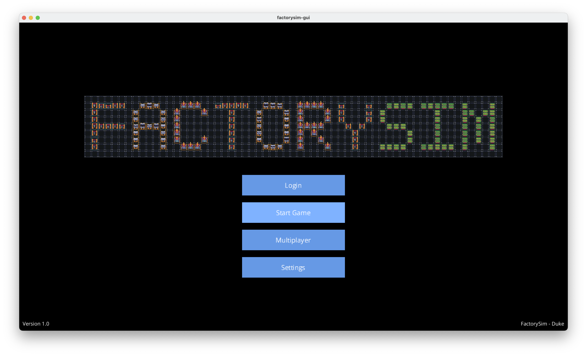
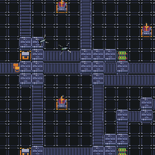

# FactorySIM

An educational, large-scale factory simulation built for Duke ECE 651 Final Project.

  
  

---
**FactorySIM** models discrete‐time, demand‐pull factory operations with both a command-line interface and a LibGDX-based graphical UI. It supports:

- **Multi-module architecture**:  
  - `factorysim/` — core simulation logic  
  - `factorysim-gui/` — LibGDX GUI  
  - `factorysim-server/` — optional networked control  
- **Tech stack**: Java · LibGDX · Gradle · GSON · JUnit